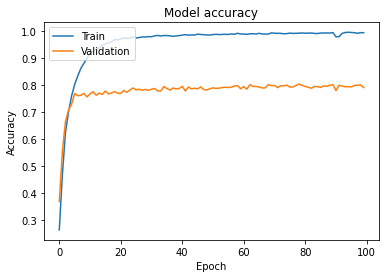
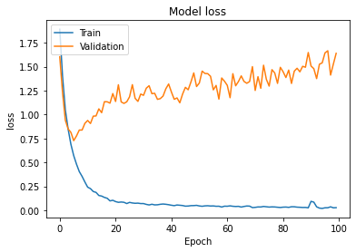
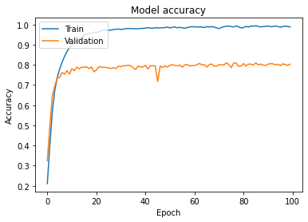
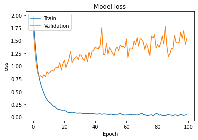
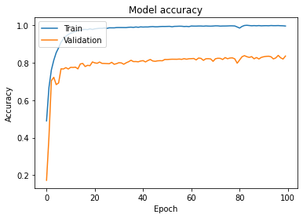
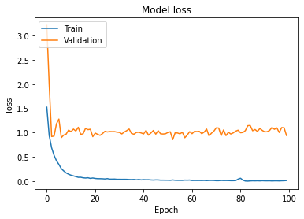
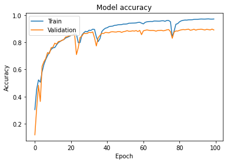
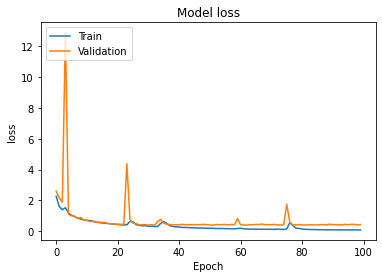
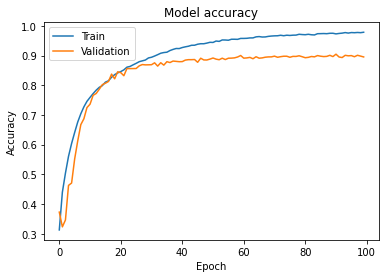
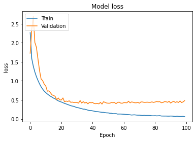

# Testing Generalization techniques on CNN

## Introduction

In this code, I experiment with different techniques for increasing the generalization capability of CNN. Here is my CNN implementation in tensorflow. This model takes inspiration from the **VGG16** architecture with convolutional blocks followed by a max pooling layer. The last layers are fully connected layers for the classification task. **This implementation has some modifications on the original VGG net** to work on the CIFAR-10 dataset and to experiment with the model’s ability to increase the model’s generalization. 

## Motivation

Why do you make this project when there are many VGG16 implementations with CIFAR10 dataset on the internet already?

Indeed there are many similar projects to this one online. However, my purpose when doing this project is to experiment all the generalization techniques by myself such as changing and adding layers of the network or techniques, and observe the results based on my current understanding and learn new things.

## Datasets

| Dataset                | Classes |    #Train images      |    #Validation images      |
|------------------------|:---------:|:-----------------------:|:----------------------------:|
| CIFAR-10               |    10   |          50K         |              10k            |

  
- **CIFAR-10**:
  I use the CIFAR-10 dataset due to its popularity and also it it is easy to setup in keras. In addition, because I need to do apply different changes and train the model again manytimes, I need the model to do computations quickly and CIFAR-10 is simple enough compared to other color image datasets. In my code, I download the CIFAR-10 dataset using tf.keras.datasets.cifar10.load_data() function. You can manually download the dataset from the [CIFAR homepage](https://www.cs.toronto.edu/~kriz/cifar.html).

## Model architecture
In the first part, I remove 1 conv2d layer from each block 3, 4 and 5 from the original VGG16 model (model A). Therefore, each block will have 2 conv2d layers followed by a max pooling layer. In the second part, I add in the conv2d layers to make the model similar to the original VGG16 model to see whether it improves  the model performance. Then, I add in some generalization techniques which will be discussed in the next section.

## Experiments and Results

Here are some hyperparameters I use in all the executions:  
batch_size = 256  
epochs = 100  
lr = 0.001  

In my first experiment, I ran only model A without any techniques to see how well the model did on training. Below are the accuracy and loss results. Even though the training accuracy got very high, the validation accuracy didn’t catch up. My conclusions are:
- The model architecture is good enough to be able to learn on this dataset even though some conv2d layers were remove from the original architecture
- The model is having a high variance problem (or overfitting) because the gap between training and validation is big enough (about 20%). This problem can be fixed by some methods in the second part.
- The model converges very quickly during the first few epochs. However, validation loss starts to increase telling us that the model starts to overfit the training data.  

   
  <i>Model's accuracy without generalization techniques.</i>

   
  <i>Model's loss without generalization techniques.</i>

  
Then, I added the conv2d layers to bring the original VGG16 architecture back. There was no improvement. The VGG16 model may be overkill for the CIFAR-10 dataset. However, for more complex datasets, the extra layers might be necessary.  

   
  <i>VGG16's accuracy without generalization techniques.</i>

   
  <i>VGG16's loss without generalization techniques.</i>

  

Now I try some generalization techniques. I added in Batch Normalization after the activations of convolutional layers. The activations of the layers in mini batches are normalized. This helps the training process stable and faster and increases model's generalization. I also learned that batch size should be at least 16 for batch normalization to be stable. I also reduce the learning rate to 0.0005 for more stable training. The results can be seen below. My observations are:  
- The validation accuracy increases about 3.8% (80% to 83.8%). This is a good improvement considering only 1 technique is added in.
- More importantly, looking at the loss values, before adding in BN, loss values actually increases when the model becomes overfitting. Here, the loss values are stable which tell us that the overfitting problem is mostly solved.  

   
  <i>VGG16's accuracy with Batch Normalization.</i>

   
  <i>VGG16's loss with Batch Normalization.</i>

  

In the next step, I want to make the training process harder for the model, and hope to increase the validation accuracy furthermore. I added in data augmentation (resize, random crop, random flip). In addition, DropOut also added to prevent model from memorizing the training data instead of trying to learn the general representations. The results are below. The generalization of the model increases significantly (about 5-6%). There are some spikes in the accuracy and loss, this is because of the Dropout and data augmentation which makes the training process harder for the model. In our final part, we will add in some more techniques to stablize the training process more.  

   
  <i>VGG16's accuracy with Batch Normalization.</i>

   
  <i>VGG16's loss with Batch Normalization.</i>

  

In the last experiment, I added in most of the techniques that I think that can stabilise the training process such as He weight initialization and skip connection. The result does not improve much (about 1% better in validation). However, since the model was already good, 1% increase is still a good improvement. More importantly, we see that the spikes disappear from the training process. This means that the skip connections we added in did the job of making the training process more stable.

   
  <i>VGG16's accuracy after stabilization.</i>

   
  <i>VGG16's loss after stabilizationn.</i>

## Further researches
Recently I read some ideas about the disharmony between Batch Normalization and Dropout, or what the correct order for them is (Should BN be placed before dropout or vice versa, or should BN be placed before or after Relu layer?). Should we just use only BN or only DropOut as they can cause some conflicts? Overall, more experiments about them should be made in the future.

## References

- My implementation is inspired by and therefore borrows many parts from [Very Deep Convolutional Networks for Large-Scale Image Recognition](https://arxiv.org/abs/1409.1556) paper
